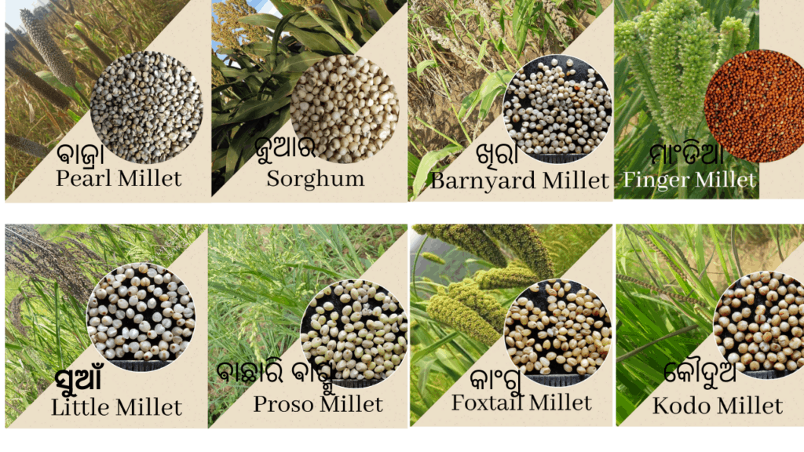

# Millets

Millet grains have been discovered in pots used for storing grans and seeds discovered at archaeological sites in present day China, India, Europe and different parts of Africa. Millets have been a good part of the staple diet among many communities across the world. We find millets popping up in literature, sculptures, paintings,  folk songs and religious compositions from different times and geographies. One finds many millet preparations in traditional cuisines surviving to this day in different parts of India, China, Japan, Korea, Russia, Turkey, Russia, Ethiopia, etc.

Millets are extremely hardy crops with some, like Proso millet, needing just 70 days to be ready for harvest. This adaptation to short cultivation times is probably what made this the staple grain of nomadic communities across the Central Asia, spreading far as these tribes moved from place to place.

When compared to other cereal grains, millets do not ask much from the soil, are rain fed, and are not susceptible to pests either in the field or during storage. Considering how likely it would be that early humans would be able to access dry, rain fed lands as compared to wetlands, it becomes apparent that millets would be the go to grains to meet dietary needs. In fact, as we move forward in time, we see that as agricultural communities were able to avail of irrigation, more and more of them have lose out on their millet heritage.

In India, some millet or the other continues to be a significant (but fast eroding) part of adivasi / tribal communities’ diets in different parts of the subcontinent. Until the large scale investments in paddy and wheat promotion through the green revolution, millets were the staple grains of large sections of the population that did not have access to assured irrigation for their lands.

With growing health consciousness, environmental concern, and the pressing need for updating our food systems to survive climate change, millets, probably the earliest of cereal grains that humans started domesticating, are making a comeback.

<figure><figcaption>
 v
</figcaption></figure>

<figure><figcaption></figcaption></figure>


A video to help you identify different types of millets (in English)


Check out this 6 part webinar to [Know more about millets](https://youtube.com/playlist?list=PLnZpIRzV27RTR7Lsmdsm4MtvXrm2gjpg6)&#x20;
