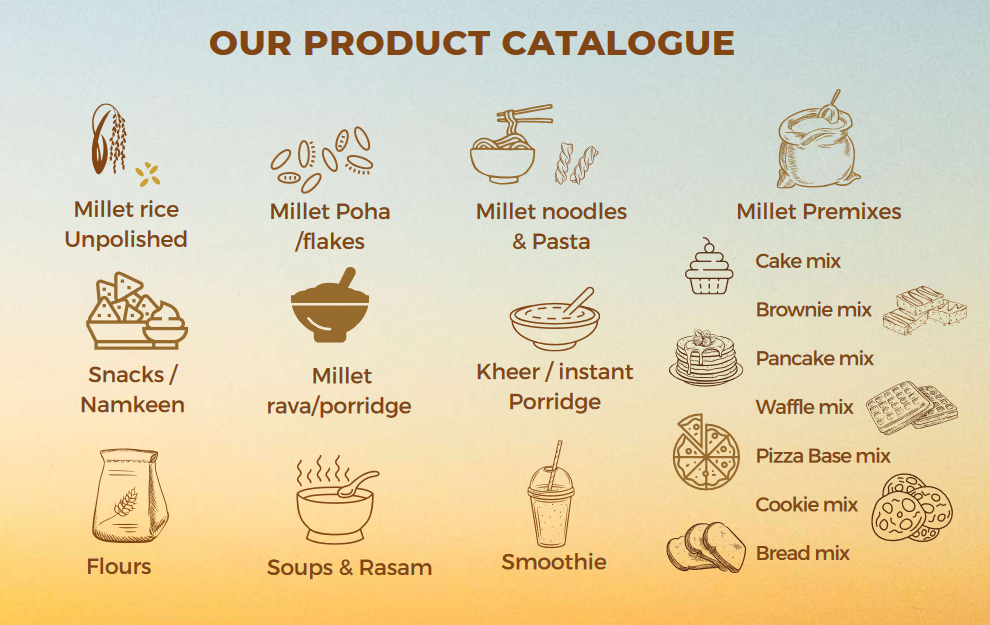

# Value Addition

Small millet based value added products including traditional recipes, bakery products, pasta products, flaked and popped products instant food mixes were developed and standardized. The products which are commonly prepared by the farmers using cereals were replaced with small millets to increase their utilisation.

<figure><figcaption></figcaption></figure>

<figure><figcaption></figcaption></figure>

### Traditional Recipes

<figure><figcaption></figcaption></figure>

• Breakfast food: Idli, Dosa, Idiappam, Rotti, Pittu, Upma, Adai, Porridge, Khakra, Paniyaram and Chappathi.&#x20;

• Sweets: Halwa, sweat kolukattai, Adhirasam, Kesari, Nutritious ball and Kheer.&#x20;

• Snacks: Vadai, Pakoda, Ribbon pakoda, Omapodi, Murukku, Thattu vadai, Hot kolukattai and Vadagam.

### Bakery Products

<figure><figcaption></figcaption></figure>

People of all ages are affectionate of different bakery products, because of their taste, colour and easy to digest nature. Celebrating any moment of happiness is incomplete with bakery products. Bakery products are becoming prominent day by day. Nowadays individuals have virtually no time to invest much on making breakfast it is the bread and bun or biscuits which had occurred instead of other sorts of stuff. They are good supply of snacks and therefore are broadly available. Small millets were incorporated in different variations from 10% to 50% levels to standardize bread (20%), cake (30%), cookies (50%), soup sticks (20%)and khari (40%) replacing refined wheat flour.

### Pasta Products

<figure><figcaption></figcaption></figure>

Pasta meals like vermicelli, noodles, macaroni etc., are commonly liked by children of today's generation and by other age groups for their taste, inexpensive and easy method of preparation. Pasta is a perfect foundation for healthy, nutritious and satisfying meals, generally eaten with nutrient-dense food partners, such as fiber-filled vegetables and beans, heart healthy fish and monounsaturated oils, antioxidant-rich tomato sauce and protein-packed cheeses, egg, poultry and lean meats. For small millets to be competitive with important cereal foods, preprocessed or alternative millet based foods are required. Vermicelli, noodles Macaroni were prepared from refined wheat flour and blending with small millets at 30%incorporation levels.

### Flaked and Popped Products

Cereal popped products and flakes are popular breakfast foods and at present they are mostly made from corn. By suitable processing it might be feasible to produce popped foods and flakes from millets. These Ready-To-Eat products are very popular, being crisp and friable in texture. The relatively smaller size and quick hydration of millets make them most suitable for the production of flakes and popped products. Small millets were flaked and popped and a variety of recipes were standardized.

**Value added products from small millet flakes** - aval uppma, kitchadi, payasam, masala flakes, boli, sweet balls, lemon bath, tamarind bath and tomato bath.&#x20;

**Value added products from popped small millets** - uppma, bhelpoori, masala corn, cheeian.

### Instant Food mixes

<figure><figcaption></figcaption></figure>

In the modern days where the life is at fast pace with the time very valuable to every person, "Instant Foods" play an important role in everyone's day-to-day life. The very term 'instant food' means simple, fast and convenient food which is easy and fast to prepare besides being hygienic, free from microbial contamination and also convenient to eat. Unlike olden days where man used to have his food lavishly and slowly, the present trend changed the habits to foods which are simple and easy to digest. Hence, the existence of these foods fulfilled all the needs of modern human being. Traditional south Indian breakfast foods viz., adai, pittu, idiyapam, kali, roti, and kesari were selected. Instant mixes ofthese traditional products with the incorporation of small millets were standardized.
