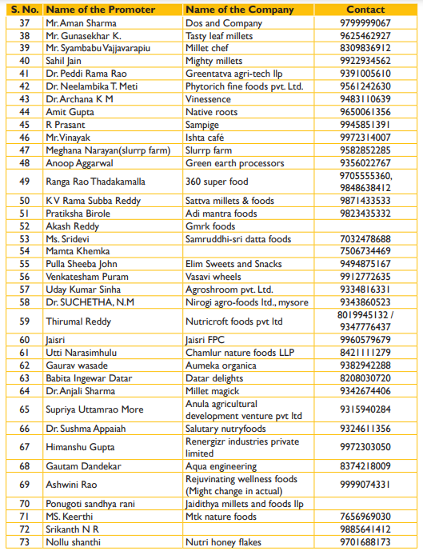

# Millets - vernacular names and images

<figure><figcaption></figcaption></figure>

<figure><figcaption></figcaption></figure>

This [brochure](https://www.fssai.gov.in/upload/uploadfiles/files/Guidance\_Notes\_Version\_2\_Millets\_29\_01\_2020.pdf) by FSSAI contains information like nutrition, vernacular names, health benefits and uses for all types of millets; useful for farmers, CSOs, general audience.
